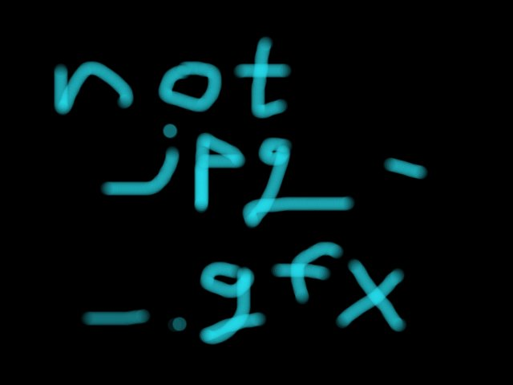

# Python Challenge - Level 12

- Link: http://www.pythonchallenge.com/pc/return/evil.html
- Username: **huge**
- Password: **file**

## Problem


Checking the source, the image is named as ``evil1.jpg``. Try ``evil2`` and you will see:

http://www.pythonchallenge.com/pc/return/evil2.jpg



Change suffix to ``.gfx`` to download the file

## Solution

```python
data = open("evil2.gfx", "rb").read()
for i in range(5):
    open('%d.jpg' % i ,'wb').write(data[i::5])
```    

Open the generated ``0.jpg`` through ``4.jpg``, you should see ``dis``, ``pro``, ``port``, ``tional``

## Next Level

http://www.pythonchallenge.com/pc/return/disproportional.html

