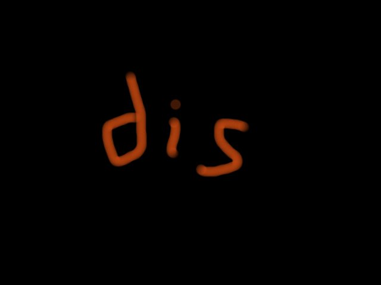

# Python Challenge - Level 12

- Link: http://www.pythonchallenge.com/pc/return/evil.html
- Username: **huge**
- Password: **file**

## Problem


Checking the source, the image is named as ``evil1.jpg``. Try ``evil2`` and you will see:

http://www.pythonchallenge.com/pc/return/evil2.jpg


Change suffix to ``.gfx`` to download the file

Is it over? Try evil3.jpg, we got:


Really? "no more evils"? Let's try evil4.jpg. Depend on your browser, you may see nothing or an error message

> The image "http://www.pythonchallenge.com/pc/return/evil4.jpg" cannot be displayed because it contains errors.

But, it is not 404! Let's take a closer look:

```bash
$ curl -u huge:file http://www.pythonchallenge.com/pc/return/evil4.jpg
Bert is evil! go back!
```

OK, Bert is evil, whoever that is.

## Solution

It is hard to tell what's going on inside the file.

```python
>>> data = open("evil2.gfx", "rb").read()
>>> data
b'\xff\x89G\x89\xff\xd8PIP\xd8\xffNFN
```

Back to the problem's image, someone is dealing the cards into 5 stacks, and all the cards are ... 5. 

```python
>>> len(data)
67575
```

Let's try to split the data into 5, but "dealing" the bytes instead of cards...

```python
>>> for i in range(5):
...     open('%d.jpg' % i ,'wb').write(data[i::5])
```


Open the generated ``0.jpg`` through ``4.jpg``, you should see ``dis``, ``pro``, ``port``, ``tional``





### Put Everything Together

```python
data = open("evil2.gfx", "rb").read()
for i in range(5):
    open('%d.jpg' % i ,'wb').write(data[i::5])
```    

## Next Level

http://www.pythonchallenge.com/pc/return/disproportional.html

<div class="ad">
<script src='//z-na.amazon-adsystem.com/widgets/onejs?MarketPlace=US&amp;adInstanceId=0f3c2d71-0c18-4aca-be44-ba6e8892af33&amp;storeId=xstore0b-20'></script> 
</div>  