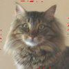

# Python Challenge - Level 14


Problem Link
------------

- http://www.pythonchallenge.com/pc/return/italy.html
- Username: **huge**
- Password: **file**


## Clues

### Clue 1

In HTML source code:

```html
<!-- remember: 100*100 = (100+99+99+98) + (...  -->


```

This is the image:


### Clue 2

Title of the HTML:

> walk around

### Clue 3

The image of the problem: we are looking at(for) something spiral!

## Exploration

Do not be fooled by that barcode-like image, it appears to be a square, that is because in HTML both the width and height are set as 100.

```python
>>> from PIL import Image
>>> im = Image.open('../images/wire.png')
>>> im.size
(10000, 1)
```

The real size is not ``100*100``! It is ``10000*1``! 

Based on all the clues, our assumption is to use the 10000 points from the given image, create another image of 100*100, by walking around the square from 
outside to inside, so we go right for 100 pixels, then down 99 pixels, then left 99 pixels, then up 98 pixels(clue 1).


## Solution

```python
from PIL import Image
im = Image.open('wire.png')
delta = [(1,0),(0,1),(-1,0),(0,-1)]
out = Image.new('RGB', [100,100])
x,y,p = -1,0,0
d = 200 
while d/2>0:
    for v in delta:
        steps = d // 2
        for s in range(steps):
            x, y = x + v[0], y + v[1]
            out.putpixel((x, y),im.getpixel((p,0)))
            p += 1
        d -= 1
out.save('level_14_result.jpg')
```



It's a cat!

## Next Level
http://www.pythonchallenge.com/pc/return/cat.html


and its name is uzi. you'll hear from him later. 


http://www.pythonchallenge.com/pc/return/uzi.html

<div class="ad">
<script src='//z-na.amazon-adsystem.com/widgets/onejs?MarketPlace=US&amp;adInstanceId=0f3c2d71-0c18-4aca-be44-ba6e8892af33&amp;storeId=xstore0b-20'></script> 
</div>  