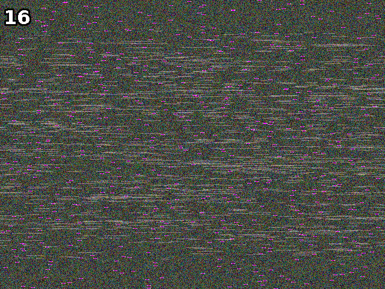
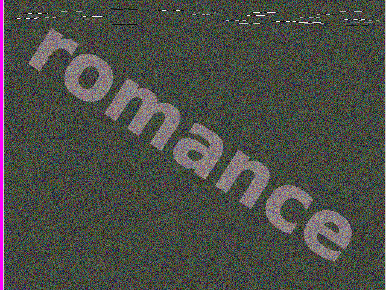

# Python Challenge - Level 16



## Problem Link

- Link: http://www.pythonchallenge.com/pc/return/mozart.html
- Username: **huge**
- Password: **file**


Clues
-----

### Clue 1

Page Title: 

> let me get this straight

### Clue 2

Image: There are pink segments, looks like they have the same length.

## Exploration

Sounds like we need to align the pink segments. But how do you define "pink"

### Find the Pink Segments

First load the image:

```python
from PIL import Image, ImageChops

image = Image.open("mozart.gif")
```

Could it be the most frequent pixels? ``image.histogram()`` can give us the counts of each pixel.

```python
>>> max(enumerate(image.histogram()), key=lambda x: x[1])
(60, 29448)
```

So value 60 appears 29448 times, let's see if it is pink. We can make a copy of the current image(to use the same palette), and paint all the pixels as 60:

```python
>>> tmp = image.copy()
>>> tmp.frombytes(bytes([60] * (tmp.height * tmp.width)))
>>> tmp.show()
```


Hmm, not so pinky.

If pink segments exists in every row, then the number of pink pixels should be divisible by height of the image, right?

```python
>>> [x for x in image.histogram() if x % image.height == 0 and x != 0]
[2400]
```

Good, there's only one!

```
>>> image.histogram().index(2400)
195
```

Let's try pixel value of 195 instead of 60

```python
>>> tmp.frombytes(bytes([195] * (tmp.height * tmp.width)))
>>> tmp.show()
```


Now it looks right. 

### Shift The Rows

Let's shift each row:

```python
import numpy as np
>>> shifted = [bytes(np.roll(row, -row.tolist().index(195)).tolist()) for row in np.array(image)]

```

We are using  ``np.array(image)`` to load image data, alternatively you can use ``list(image.getdata())``, however you will get a one-dimension array, so you
 need to reshape the array manually. 

We take each ``row`` in the ndarray, and get the first position of the pink pixel by ``row.tolist().index(195)``, then ``np.roll()`` can help us shift the 
array. 

Once we have the shifted data as ``bytes``, we can use ``Image.frombytes()`` to create a new image, while reusing the original image's mode and size.

```python
>>> Image.frombytes(image.mode, image.size, b"".join(shifted)).show()
```

Here's the result:



## Solution

### Solution 1

```python
from PIL import Image, ImageChops
import numpy as np
image = Image.open("mozart.gif")
shifted = [bytes(np.roll(row, -row.tolist().index(195)).tolist()) for row in np.array(image)]
Image.frombytes(image.mode, image.size, b"".join(shifted)).show()
```

### Solution 2

```python
from PIL import Image, ImageChops

image = Image.open("mozart.gif")

for y in range(image.size[1]):
    box = 0, y, image.size[0], y + 1
    row = image.crop(box)
    bytes = row.tobytes()
    i = bytes.index(195)
    row = ImageChops.offset(row, -i)
    image.paste(row, box)

image.save("level16-result.gif")
```

Result: romance!

## Next Level

http://www.pythonchallenge.com/pc/return/romance.html

<div class="ad">
<script src='//z-na.amazon-adsystem.com/widgets/onejs?MarketPlace=US&amp;adInstanceId=0f3c2d71-0c18-4aca-be44-ba6e8892af33&amp;storeId=xstore0b-20'></script> 
</div>  