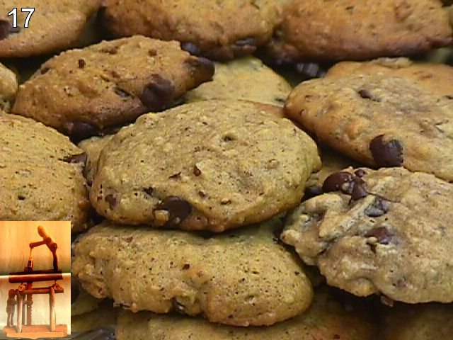

# Python Challenge - Level 17

- Link: http://www.pythonchallenge.com/pc/return/romance.html
- Username: **huge**
- Password: **file**

## Problem



## Solution

Part 1:

```python
from urllib.request import urlopen
from urllib.parse import unquote_plus, unquote_to_bytes
import re, bz2

num = '12345'
info = ''
while(True):
    h = urlopen('http://www.pythonchallenge.com/pc/def/linkedlist.php?busynothing='+num)
    raw = h.read().decode("utf-8")
    print(raw)
    cookie = h.getheader("Set-Cookie")
    info += re.search('info=(.*?);', cookie).group(1)
    match = re.search('the next busynothing is (\d+)', raw)
    if match == None: 
        break
    else:
        num = match.group(1)
res = unquote_to_bytes(info.replace("+", " "))
print(res)
print(bz2.decompress(res).decode())
```

Output:

```
...
and the next busynothing is 96070
and the next busynothing is 83051
that's it.
b'BZh91AY&SY\x94:\xe2I\x00\x00!\x19\x80P\x81\x11\x00\xafg\x9e\xa0 \x00hE=M\xb5#\xd0\xd4\xd1\xe2\x8d\x06\xa9\xfa&S\xd4\xd3!\xa1\xeai7h\x9b\x9a+\xbf`"\xc5WX\xe1\xadL\x80\xe8V<\xc6\xa8\xdbH&32\x18\xa8x\x01\x08!\x8dS\x0b\xc8\xaf\x96KO\xca2\xb0\xf1\xbd\x1du\xa0\x86\x05\x92s\xb0\x92\xc4Bc\xf1w$S\x85\t\tC\xae$\x90'
```

And the final line:
```
is it the 26th already? call his father and inform him that "the flowers are on their way". he'll understand.
```

Part 2:

```python
from xmlrpc.client import ServerProxy

conn = ServerProxy("http://www.pythonchallenge.com/pc/phonebook.php")

print(conn.phone("Leopold"))
```

```
555-VIOLIN
```

Visit http://www.pythonchallenge.com/pc/return/violin.html

```
no! i mean yes! but ../stuff/violin.php.
```

Part 3:

```python
from urllib.request import Request, urlopen
from urllib.parse import quote_plus

url = "http://www.pythonchallenge.com/pc/stuff/violin.php"
msg = "the flowers are on their way"
req = Request(url, headers = { "Cookie": "info=" + quote_plus(msg)})

print(urlopen(req).read().decode())
```

```html
<html>
<head>
  <title>it's me. what do you want?</title>
  <link rel="stylesheet" type="text/css" href="../style.css">
</head>
<body>
	<br><br>
	<center><font color="gold">
	
<br><br>
oh well, don't you dare to forget the balloons.</font>
</body>
</html>
```

## Next Level

http://www.pythonchallenge.com/pc/stuff/balloons.html

redirect to 

http://www.pythonchallenge.com/pc/return/balloons.html


