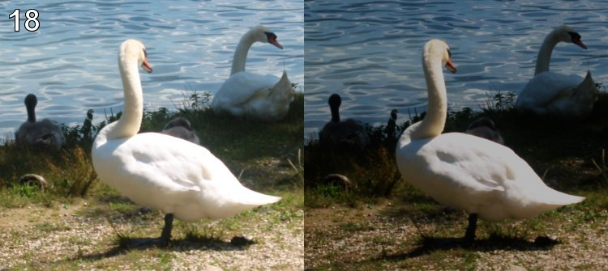

# Level 18

- Link: http://www.pythonchallenge.com/pc/return/balloons.html
- Username: **huge**
- Password: **file**

## Problem




## Solution

The difference is "brightness"... so go to

http://www.pythonchallenge.com/pc/return/brightness.html

In HTML source:

```html
<!-- maybe consider deltas.gz -->
```

Download: http://www.pythonchallenge.com/pc/return/deltas.gz


```python
>>> print(gzip.open("deltas.gz").read().decode())
```

You will see the data consists roughly two columns.

```python
import gzip, difflib

data = gzip.open("deltas.gz")
d1, d2 = [], []
for line in data:
    d1.append(line[:53].decode()+"\n")
    d2.append(line[56:].decode())


compare = difflib.Differ().compare(d1, d2)

f = open("f.png", "wb")
f1 = open("f1.png", "wb")
f2 = open("f2.png", "wb")

for line in compare:
    bs = bytes([int(o, 16) for o in line[2:].strip().split(" ") if o])
    if line[0] == '+':
        f1.write(bs)
    elif line[0] == '-':
        f2.write(bs)
    else:
        f.write(bs)

f.close()
f1.close()
f2.close()
```

``difflib.Differ().compare(a, b)`` will generate 

- lines start with ``+``: appear in a not in b
- lines start with ``-``: appear in b not in a
- others: appear in both


Result:

- ``f.png``: ../hex/bin.html
- ``f1.png``: butter
- ``f2.png``: fly

## Next Level

http://www.pythonchallenge.com/pc/hex/bin.html

- username: butter
- password: fly