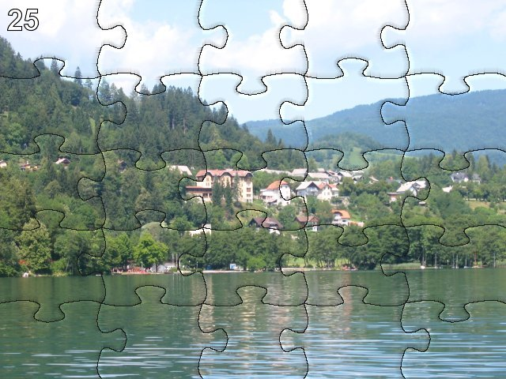

# Python Challenge - Level 25

- Link: http://www.pythonchallenge.com/pc/hex/lake.html
- Username: **butter**
- Password: **fly**

## Problem



## Solution

To download a wav file, use wget with authentication:

$ wget --user butter --password fly http://www.pythonchallenge.com/pc/hex/lake1.wav


To download all the wav files:

```bash
$ for i in {1..25}; do wget --user butter --password fly http://www.pythonchallenge.com/pc/hex/lake$i.wav; done 
```

25 wav files can be converted to 5 by 5 = 25 pieces of images


```python
from PIL import Image
import wave

wavs = [wave.open('lake/lake%d.wav' % i) for i in range(1,26)]
result = Image.new('RGB', (300,300), 0)
num_frames = wavs[0].getnframes()
for i in range(len(wavs)): 
    byte = wavs[i].readframes(num_frames)
    img = Image.frombytes('RGB', (60, 60), byte)
    result.paste(img, (60 * (i % 5), 60 * (i // 5)))
result.save('level25.png')
```

## Next Level

www.pythonchallenge.com/pc/hex/decent.html