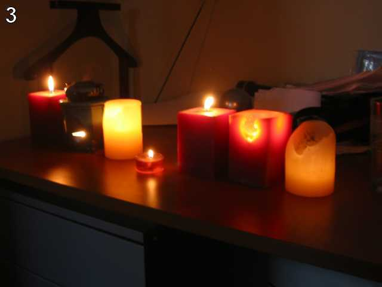

Python Challenge - Level 3
==========================

- Link: http://www.pythonchallenge.com/pc/def/equality.html


## Problem



> One small letter, surrounded by EXACTLY three big bodyguards on each of its sides.

The image shows 3 big candles on each side of a small one. The description hints us to find **letters**! So open the 
page source, we see a comment block at the bottom of the page:

```html
<!--
kAewtloYgcFQaJNhHVGxXDiQmzjfcpYbzxlWrVcqsmUbCunkfxZWDZjUZMiGq
...
```

Hmm, shall we find all segments of the pattern ```AAAbCCC```?

## Solution

### Step 1: Load Data

You can manually copy-and-paste the text to a file(``resources/level3.txt`` in source code), then read from it:

```python
>>> data = open('resources/level3.txt').read()
```

Or extract the text from HTML directly. First load raw html source coding using ``urllib.request``:

```python
>>> import urllib.request
>>> html = urllib.request.urlopen("http://www.pythonchallenge.com/pc/def/equality.html").read().decode()
```

Then extract the comment blocks in html. Note that by default dot does not match ``\n``, so we need to use ``re
.DOTALL`` flag. 

```python
>>> import re
>>> comments = re.findall("<!--(.*)-->", html, re.DOTALL)
```

Alternatively we can use this:

```python
>>> comments = re.findall("<!--([\w\n]*)-->", html)
```

The pattern ``<!--(.*)-->`` will capture all blocks inside ``<!--`` and ``-->``. We only care about the last part, so

```python
>>> data = comments[-1]
```

This level only has one comment block, so it is not really necessary, but later it would be helpful.

### Step 2: Find the Matches

Now we have the content as a big long string, we can use regular expression to find all the matches. The 
pattern can be described as ``[^A-Z]+[A-Z]{3}([a-z])[A-Z]{3}[^A-Z]+``. Here's a break 
down of the pattern:

- ``[a-z]``: 1 lower case letter
- ``[A-Z]``: 1 upper case letter
- ``[A-Z]{3}``: 3 consecutive upper case letters
- ``[A-Z]{3}[a-z][A-Z]{3}``: 3 upper case letters + 1 lower case letter + 3 upper case letters
- ``[^A-Z]``: any character BUT an upper case letter
- ``[^A-Z]+``: at least one such character
- ``[^A-Z]+[A-Z]{3}[a-z][A-Z]{3}[^A-Z]+``: something else before and after our patter(``AAAbCCC``) so there's no 
more than 3 consecutive upper case letters on each side
- ``[^A-Z]+[A-Z]{3}([a-z])[A-Z]{3}[^A-Z]+``: ...and we only care about the lower case

Let's see what we get:

```python
>>> re.findall("[^A-Z]+[A-Z]{3}([a-z])[A-Z]{3}[^A-Z]+", data)
['l', 'i', 'n', 'k', 'e', 'd', 'l', 'i', 's', 't']
```

And join them together

```python
>>> "".join(re.findall("[^A-Z]+[A-Z]{3}([a-z])[A-Z]{3}[^A-Z]+", data))
'linkedlist'
```

That's it! **linkedlist**.

### Put Everything Together

```python
import urllib.request
import re

html = urllib.request.urlopen("http://www.pythonchallenge.com/pc/def/equality.html").read().decode()
data = re.findall("<!--(.*)-->", html, re.DOTALL)[-1]
print("".join(re.findall("[^A-Z]+[A-Z]{3}([a-z])[A-Z]{3}[^A-Z]+", data)))
```

## Next Level

http://www.pythonchallenge.com/pc/def/linkedlist.html

The page will redirect you to ``linkedlist.php``

http://www.pythonchallenge.com/pc/def/linkedlist.php

## Further Readings

- [Python 3 - RegEx](http://www.hackingnote.com/en/python/re/)