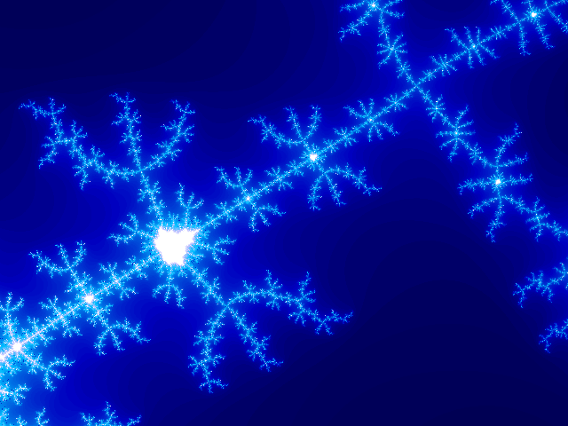

# Python Challenge - Level 31

- Link: http://www.pythonchallenge.com/pc/ring/grandpa.html
- Username: **repeat**
- Password: **switch**

Click image

- Username: **kohsamui**
- Password: **thailand**

## Problem


Click on the image:

> That was too easy. You are still on 31... 



In page source:

```html

<window left="0.34" top="0.57" width="0.036" height="0.027"/>
<option iterations="128"/>
```

## Solution

It is a image of the [Mandelbrot set](https://en.wikipedia.org/wiki/Mandelbrot_set). 

> The Mandelbrot set is the set of complex numbers c for which the function f(z) = z^2 + c does not diverge when iterated from z = 0, i.e., for which the sequence f(0), f(f(0)), etc., remains bounded in absolute value.

To slightly translate this into English: every pixel in the 2-d image ``(x, y)``, uniquely represents a complex number 
``c``, we let ``z = 0 + 0j``, then repeatedly calculate ``z = z * z + c``, if ``z`` is always within a range(not 
going to infinity), we light this pixel up, otherwise we mark it as dark. Actually we check at which iteration it 
starts to diverge, and set color to that number of iteration.

In page source we are given 4 number: left, top, width, height, that is the bound of our calculation. Suppose the 
image we are going to produce has width ``w`` and height ``h``, then ``x`` should be from ``0`` to ``w - 1``, and 
``y`` should be from ``0`` to ``h - 1``. The real part of the ``c`` can be computed by ``left + x * width / w``, and 
imaginary part is ``bottom + y * height / h``

```python
from PIL import Image

img = Image.open("mandelbrot.gif")

left = 0.34
bottom = 0.57
width = 0.036
height = 0.027
max = 128

w, h = img.size

xstep = width / w
ystep = height/ h

result = []

for y in range(h - 1, -1, -1):
    for x in range(w):
        c = complex(left + x * xstep, bottom + y * ystep)
        z = 0 + 0j
        for i in range(max):
            z = z * z + c
            if abs(z) > 2: 
                break
        result.append(i)

img2 = img.copy()
img2.putdata(result)
img2.show()

diff = [(a - b) for a, b in zip(img.getdata(), img2.getdata()) if a != b]
print(len(diff))

plot = Image.new('L', (23, 73))
plot.putdata([(i < 16) and 255 or 0 for i in diff])
plot.resize((230,730)).show()
```

## Extra Links

https://en.wikipedia.org/wiki/Arecibo_message


<div class="ad">
<script src='//z-na.amazon-adsystem.com/widgets/onejs?MarketPlace=US&amp;adInstanceId=0f3c2d71-0c18-4aca-be44-ba6e8892af33&amp;storeId=xstore0b-20'></script> 
</div>  