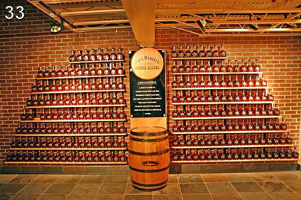

# Python Challenge - Level 33

- Link: http://www.pythonchallenge.com/pc/rock/beer.html
- Username: **kohsamui**
- Password: **thailand**


## Problem



## Solution

```python
>>> im.size
(138, 138)
>>> im.mode
'L'
>>> list(im.getdata())
[1, 43, 7, 13, 7, 1, 1, 85, 25, 85,...]
>>> im.histogram()
[0, 1532, 232, 0, 0, 0, 0, 963, 189, 0, 0, 0, 0, 724, 329, 0, 0, 0, 0, 549, 243, 0, 0, 0, 0, 144, 424, 0, 0, 0, 0, 119, 328, 0, 0, 0, 0, 126, 339, 0, 0, 0, 0, 126, 357, 0, 0, 0, 0, 107, 225, 0, 0, 0, 0, 79, 609, 0, 0, 0, 0, 181, 356, 0, 0, 0, 0, 70, 298, 0, 0, 0, 0, 23, 164, 0, 0, 0, 0, 26, 354, 0, 0, 0, 0, 47, 341, 0, 0, 0, 0, 139, 257, 0, 0, 0, 0, 104, 505, 0, 0, 0, 0, 192, 224, 0, 0, 0, 0, 114, 310, 0, 0, 0, 0, 32, 183, 0, 0, 0, 0, 238, 198, 0, 0, 0, 0, 117, 327, 0, 0, 0, 0, 110, 342, 0, 0, 0, 0, 118, 342, 0, 0, 0, 0, 145, 323, 0, 0, 0, 0, 152, 324, 0, 0, 0, 0, 161, 323, 0, 0, 0, 0, 175, 317, 0, 0, 0, 0, 183, 317, 0, 0, 0, 0, 171, 337, 0, 0, 0, 0, 198, 318, 0, 0, 0, 0, 241, 283, 0, 0, 0, 0, 1348, 272, 0, 0, 0, 0, 0, 0, 0, 0, 0, 0, 0, 0, 0, 0, 0, 0, 0, 0, 0, 0, 0, 0, 0, 0, 0, 0, 0, 0, 0, 0, 0, 0, 0, 0, 0, 0, 0, 0, 0, 0, 0, 0, 0, 0, 0, 0, 0, 0, 0, 0, 0, 0, 0, 0, 0, 0, 0, 0, 0, 0, 0]

>>> list(enumerate(im.histogram()))
[(0, 0), (1, 1532), (2, 232), (3, 0), (4, 0), (5, 0), (6, 0), (7, 963), (8, 189), (9, 0), (10, 0), (11, 0), (12, 0), (13, 724), (14, 329), (15, 0), (16, 0), (17, 0), (18, 0), (19, 549), (20, 243), (21, 0), (22, 0), (23, 0), (24, 0), (25, 144), (26, 424), (27, 0), (28, 0), (29, 0), (30, 0), (31, 119), (32, 328), (33, 0), (34, 0), (35, 0), (36, 0), (37, 126), (38, 339), (39, 0), (40, 0), (41, 0), (42, 0), (43, 126), (44, 357), (45, 0), (46, 0), (47, 0), (48, 0), (49, 107), (50, 225), (51, 0), (52, 0), (53, 0), (54, 0), (55, 79), (56, 609), (57, 0), (58, 0), (59, 0), (60, 0), (61, 181), (62, 356), (63, 0), (64, 0), (65, 0), (66, 0), (67, 70), (68, 298), (69, 0), (70, 0), (71, 0), (72, 0), (73, 23), (74, 164), (75, 0), (76, 0), (77, 0), (78, 0), (79, 26), (80, 354), (81, 0), (82, 0), (83, 0), (84, 0), (85, 47), (86, 341), (87, 0), (88, 0), (89, 0), (90, 0), (91, 139), (92, 257), (93, 0), (94, 0), (95, 0), (96, 0), (97, 104), (98, 505), (99, 0), (100, 0), (101, 0), (102, 0), (103, 192), (104, 224), (105, 0), (106, 0), (107, 0), (108, 0), (109, 114), (110, 310), (111, 0), (112, 0), (113, 0), (114, 0), (115, 32), (116, 183), (117, 0), (118, 0), (119, 0), (120, 0), (121, 238), (122, 198), (123, 0), (124, 0), (125, 0), (126, 0), (127, 117), (128, 327), (129, 0), (130, 0), (131, 0), (132, 0), (133, 110), (134, 342), (135, 0), (136, 0), (137, 0), (138, 0), (139, 118), (140, 342), (141, 0), (142, 0), (143, 0), (144, 0), (145, 145), (146, 323), (147, 0), (148, 0), (149, 0), (150, 0), (151, 152), (152, 324), (153, 0), (154, 0), (155, 0), (156, 0), (157, 161), (158, 323), (159, 0), (160, 0), (161, 0), (162, 0), (163, 175), (164, 317), (165, 0), (166, 0), (167, 0), (168, 0), (169, 183), (170, 317), (171, 0), (172, 0), (173, 0), (174, 0), (175, 171), (176, 337), (177, 0), (178, 0), (179, 0), (180, 0), (181, 198), (182, 318), (183, 0), (184, 0), (185, 0), (186, 0), (187, 241), (188, 283), (189, 0), (190, 0), (191, 0), (192, 0), (193, 1348), (194, 272), (195, 0), (196, 0), (197, 0), (198, 0), (199, 0), (200, 0), (201, 0), (202, 0), (203, 0), (204, 0), (205, 0), (206, 0), (207, 0), (208, 0), (209, 0), (210, 0), (211, 0), (212, 0), (213, 0), (214, 0), (215, 0), (216, 0), (217, 0), (218, 0), (219, 0), (220, 0), (221, 0), (222, 0), (223, 0), (224, 0), (225, 0), (226, 0), (227, 0), (228, 0), (229, 0), (230, 0), (231, 0), (232, 0), (233, 0), (234, 0), (235, 0), (236, 0), (237, 0), (238, 0), (239, 0), (240, 0), (241, 0), (242, 0), (243, 0), (244, 0), (245, 0), (246, 0), (247, 0), (248, 0), (249, 0), (250, 0), (251, 0), (252, 0), (253, 0), (254, 0), (255, 0)]

>>> sum([x for x in im.histogram() if x != 0][:-2])
17424
```


```python
from PIL import Image
import math

im = Image.open('beer2.png')

data = list(im.getdata())

out = None

for i in range(33):
    max_value = max(data)
    data = [x for x in data if x < max_value - 1]
    print(len(data))
    l = int(math.sqrt(len(data)))
    out = Image.new('L', (l, l))
    out.putdata(data)
    out.show()
```

The letters with frames:

> gremlins


## Final Link


http://www.pythonchallenge.com/pc/rock/gremlins.html

<div class="ad">
<script src='//z-na.amazon-adsystem.com/widgets/onejs?MarketPlace=US&amp;adInstanceId=0f3c2d71-0c18-4aca-be44-ba6e8892af33&amp;storeId=xstore0b-20'></script> 
</div>  