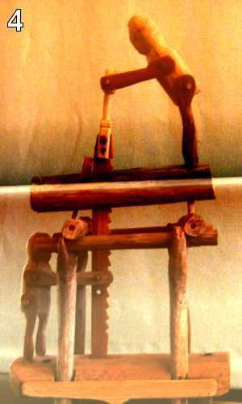

# Python Challenge - Level 4

- Link: http://www.pythonchallenge.com/pc/def/linkedlist.php

## Problem




Click on the image, you would see

> and the next nothing is 44827
  
And the url changed to ``http://www.pythonchallenge.com/pc/def/linkedlist.php?nothing=12345``

Change the url with the new number and another number will be given.

## Solution

First let's try to mimic the manual process we just tried:

```python
>>> uri = "http://www.pythonchallenge.com/pc/def/linkedlist.php?nothing=%s"
>>> num = "12345"
>>> content = urlopen(uri % num).read().decode()
>>> content
'and the next nothing is 44827'
```

Then use regular expression to extract the number:

```python
>>> match = re.search("and the next nothing is (\d+)", content)
>>> match
<_sre.SRE_Match object; span=(0, 29), match='and the next nothing is 44827'>
```

Note ``.group(0)`` will return the whole text that matches the pattern, while the captured segments start from ``.group
(1)`` 

```python
>>> match.group(0)
'and the next nothing is 44827'
>>> match.group(1)
'72198'
```

To automate this process, let's use a while loop, which stops when there's no match:

```python
>>> pattern = re.compile("and the next nothing is (\d+)")
>>> while True:
...     content = urlopen(uri % num).read().decode('utf-8')
...     print(content)
...     match = pattern.search(content)
...     if match == None:
...         break
...     num = match.group(1)
... 
and the next nothing is 44827
and the next nothing is 45439
<font color=red>Your hands are getting tired </font>and the next nothing is 94485
and the next nothing is 72198
...
and the next nothing is 16044
Yes. Divide by two and keep going.
```

Then reset ``num`` to ``16044/2``

```python
num = str(16044/2)
```

And re-run:

```
and the next nothing is 81226
and the next nothing is 4256
and the next nothing is 62734
and the next nothing is 25666
...
There maybe misleading numbers in the 
text. One example is 82683. Look only for the next nothing and the next nothing is 63579
...
peak.html
```

Note that if you use ``pattern.match()`` instead of ``pattern.search()`` it would fail, since ``.match()`` is looking
 for a match starting from the very beginning, while there's one "misleading" line in the text.
 
Finally we have the answer: **peak.html**

### Put Everything Together


```python
from urllib.request import urlopen
import re

uri = "http://www.pythonchallenge.com/pc/def/linkedlist.php?nothing=%s"

num = "12345"
#num = str(16044/2)

pattern = re.compile("and the next nothing is (\d+)")

while True:
    content = urlopen(uri % num).read().decode('utf-8')
    print(content)
    match = pattern.search(content)
    if match == None:
        break
    num = match.group(1)
```

Result

``` 
peak.html
```

## Next Level

http://www.pythonchallenge.com/pc/def/peak.html
 
## Python 2 to Python 3

Python 2's ``urllib`` and ``urllib2`` are combined as the new ``urllib``
